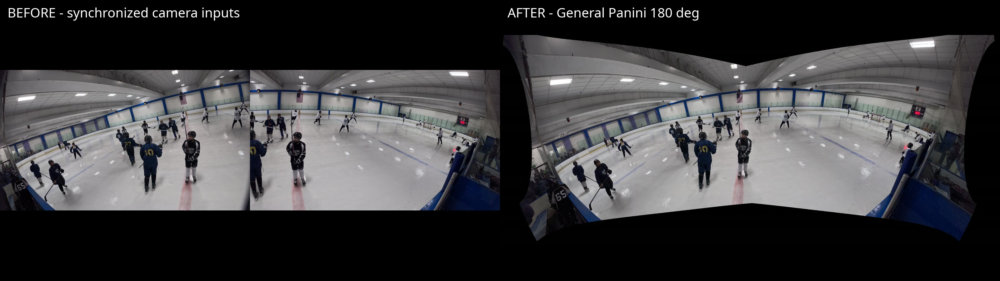
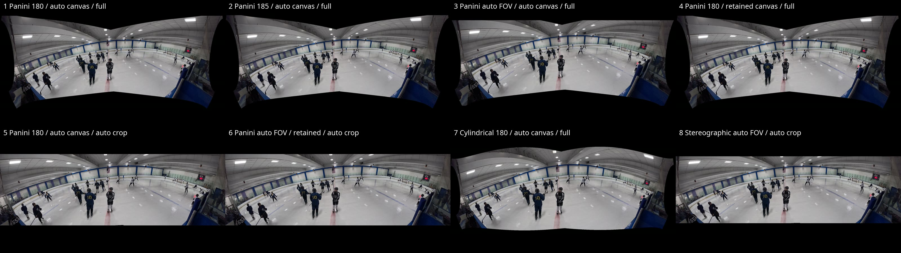
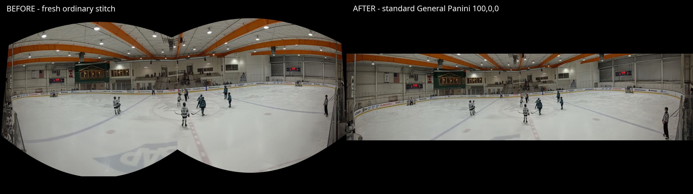

# General Panini stitching samples

These samples come from isolated calibration runs. The runner symlinks only read-only input media and calibration
assets into a temporary game, gives every case a private config/artifact directory, and verifies the source game
config remains unchanged. Production selects the output projection during its one calibration/remap-generation
phase; there is no intermediate panorama, second projection, or second remap/stitch stage.

## `gse-16a`

This game was restarted from its modified source files and calibrated in eight independent live pipeline runs on
August 28, 2026. All eight passed. “Before” is the synchronized left/right calibration frame placed side by side;
“after” is the fixed-180-degree General Panini result with automatic canvas sizing and crop disabled.

Source and fixed-180 evidence fingerprints:

```text
b2d7bfc49fa24ee4203fc04f117364d7ab420a0ab3138901130db0b933aaf024  source config.yaml (unchanged after the matrix)
28d6485a5b8e1a8b1b52af751005509f31fb64982d6d26c4df3cba732c0349e0  synchronized input pair
0985cfe183b18da7c32328604c3c8e4663dc77c8d630a046821fd6dbf86365d4  fixed-180 generated PTO
725d8d9eb710d973b99c985e635214abf87cd8785e5fb742a09aa89ebebf2840  fixed-180 version-5 provenance
dc6c4a182b37e626e99f3b53eec0455de7669dbc2d02c3728a8b7af5f80e6749  fixed-180 stitched sample
```



- [Larger before image](images/general-panini/gse-16a-before.jpg)
- [Larger after image](images/general-panini/gse-16a-after.jpg)

### Projection/framing matrix



| # | Projection and framing | PTO projection | Actual FOV | Canvas | Result |
| --- | --- | ---: | ---: | ---: | --- |
| 1 | General Panini, fixed 180°, auto canvas, crop off | `f19` | 180° | 1910×807 | Pass |
| 2 | General Panini, fixed 185°, auto canvas, crop off | `f19` | 185° | 1820×773 | Pass |
| 3 | General Panini, auto FOV/canvas, crop off | `f19` | 171° | 1968×747 | Pass |
| 4 | General Panini, fixed 180°, retained canvas, crop off | `f19` | 180° | 1910×807 | Pass |
| 5 | General Panini, fixed 180°, auto canvas/crop | `f19` | 180° | 1650×524 | Pass |
| 6 | General Panini, auto FOV, retained canvas, auto crop | `f19` | 171° | 1786×566 | Pass |
| 7 | Cylindrical, fixed 180°, auto canvas, crop off | `f1` | 180° | 1956×751 | Pass |
| 8 | Stereographic, auto FOV/canvas/crop | `f4` | 171° | 1783×531 | Pass |

Full-size outputs:

1. [General Panini fixed 180°](images/general-panini/gse-16a-matrix/01-general-panini-fixed-180.jpg)
2. [General Panini fixed 185°](images/general-panini/gse-16a-matrix/02-general-panini-fixed-185.jpg)
3. [General Panini auto FOV](images/general-panini/gse-16a-matrix/03-general-panini-auto-fov.jpg)
4. [General Panini retained canvas](images/general-panini/gse-16a-matrix/04-general-panini-retained-canvas.jpg)
5. [General Panini auto crop](images/general-panini/gse-16a-matrix/05-general-panini-auto-crop.jpg)
6. [General Panini auto FOV, retained canvas, auto crop](images/general-panini/gse-16a-matrix/06-general-panini-auto-fov-retained-auto-crop.jpg)
7. [Cylindrical fixed 180°](images/general-panini/gse-16a-matrix/07-cylindrical-fixed-180.jpg)
8. [Stereographic auto FOV/crop](images/general-panini/gse-16a-matrix/08-stereographic-auto-fov-auto-crop.jpg)

## `sharks-12-1-r4`

This is the earlier offline comparison retained as a historical reference; it was not part of the August 28 live
`gse-16a` calibration matrix.

Source optimized-PTO fingerprint:

```text
0496e19b6d212b33f3a0c0ca4ca48f9f2e2aa2e02baa5f26f3899e7a1058f18b  autooptimiser_out.pto
```



- [Larger before image](images/general-panini/sharks-12-1-r4-before.jpg)
- [Larger after image](images/general-panini/sharks-12-1-r4-after.jpg)
