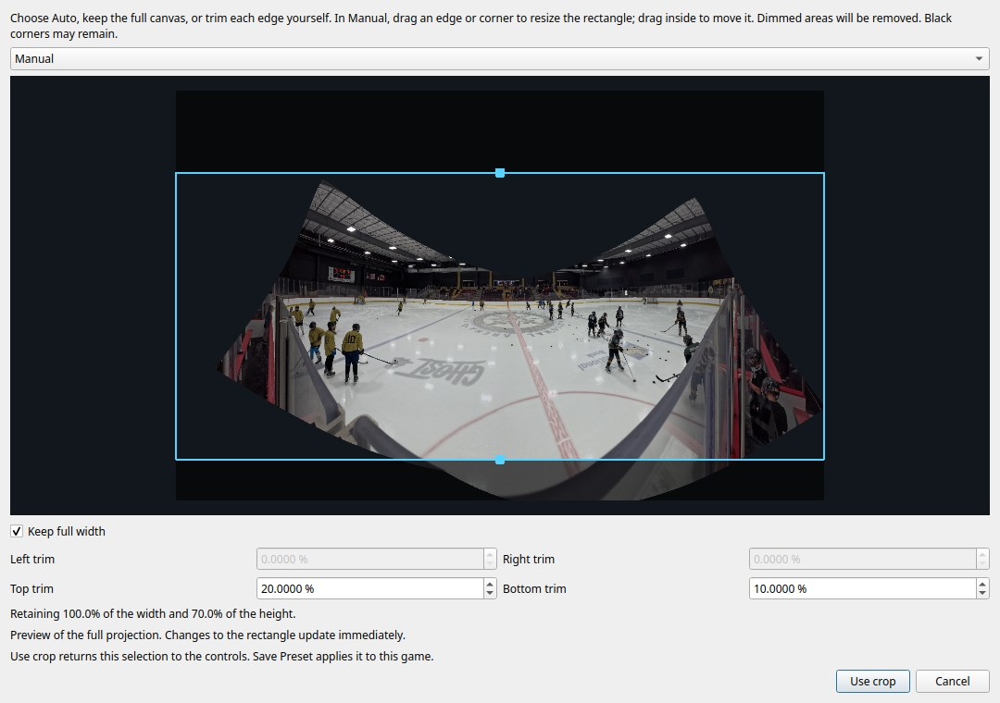

Use **Adjust crop…** in the stitching controls to control how much of the projected rink is retained. Stop
playback before editing. This control is available with the Nona mapping backend.

- **Auto — crop valid pixels** lets Hugin choose its valid-image rectangle during calibration. The editor shows
  an estimate of that rectangle when a saved calibration is available.
- **Full canvas** removes all cropping, including any saved manual trim.
- **Manual** lets you drag the rectangle's edges or corners, move it by dragging inside, or enter the percentage
  trimmed from each side. **Keep full width** sets left and right trim to zero while preserving the top and bottom.
  Turn it off again to restore the previous horizontal trim.

If Auto cuts off too much horizontally, switch to Manual and select Keep full width. Adjust the top and bottom
to taste. A game currently using Auto starts Manual from the estimated Auto rectangle when the preview is ready.
Black corners can remain when keeping more coverage; the rectangle shows exactly which area will be retained.



**Use crop** returns the selection to the main controls. **Save Preset** saves it in the game's private config and
invalidates the old stitching maps; the next calibration regenerates them. **Cancel** discards the dialog's edits.
The existing Auto checkbox remains available in the main controls.

Percentages refer to the **full projected canvas**, not the previously cropped image. For example, left/right
trim of 0%, top trim of 20%, and bottom trim of 10% saves:

```yaml
stitching:
  projection_framing:
    auto_crop: false
    crop: [0, 1, 0.20, 0.90]  # retained left, right, top, bottom bounds
```

The still preview is rendered from saved camera images and calibration at no more than 1600 pixels on either
axis. It does not read back live GPU video frames. The crop overlay changes immediately; Auto's final bounds
are recomputed at the actual output resolution during calibration. If calibration is missing, busy, or does not
match the current camera/projection settings, the editor explains why its preview is unavailable. Mode selection
and numeric trims remain available; save and calibrate the current geometry to enable the preview.
