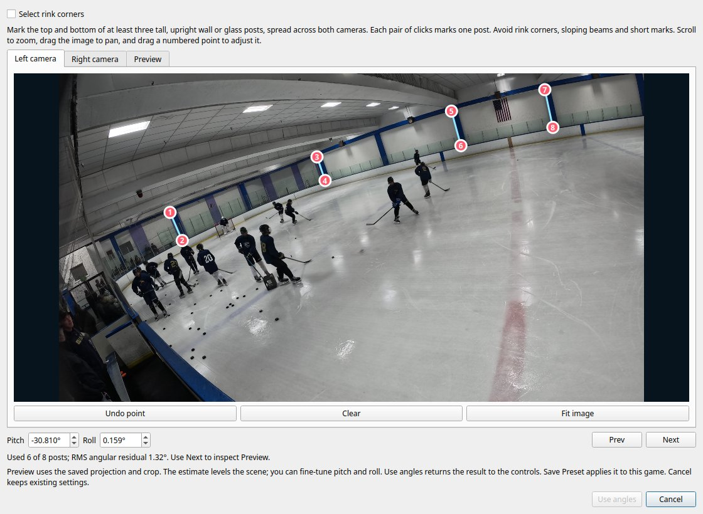
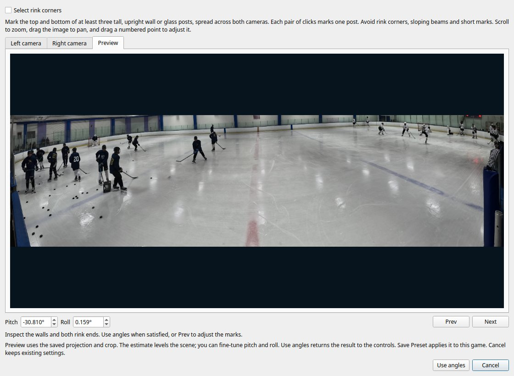

HStream's **Algorithms** tab now has a rink selector, pitch and roll controls, and an optional **Level from posts**
dialog. Vallco inherits −35° pitch and Sharks Ice inherits −25° pitch. A saved game angle overrides the rink
profile, including when it happens to equal that profile's default. **Use rink default** removes the override.
Changing the rink while a game override is active keeps the override. No rink selection inherits zero rotation.

When NONA applies a nonzero rink pitch or roll, **Program → Crop Rotation** shows zero for both sides and disables
the controls. The tracker uses the same zero angles so its crop geometry stays aligned with the Program view.
This applies to angles selected from posts or corners, manually entered angles, and inherited rink defaults. The saved crop
angles are retained and restored when pitch and roll are both zero or the mapping backend changes to OpenCV.
Yaw alone does not disable crop rotation. Final stitched-output rotation remains a separate setting.

During a NONA stitching calibration, HStream now opens the post selector immediately after panorama alignment. This
step is optional: **Skip leveling** continues with the configured angles. It is not shown for the OpenCV mapping
backends because their planar transforms do not consume Hugin's shared camera-space rotation.

To measure the angle during calibration:

1. In each source image, click the top and bottom of upright wall or glass
   posts. Select at least three posts total, including both cameras, with good horizontal separation. Four or more
   long posts work better than short or clustered marks. Ceiling beams and rink corners are unsuitable references.
2. The estimate updates automatically shortly after every selection or dragged-point adjustment. The dialog rejects
   poorly conditioned selections and reports how many posts agreed and their angular residual. Scroll to zoom and
   drag the background to pan.
3. Use **Next** and **Prev** to cycle through **Left camera → Right camera → Preview** (wrapping at either end).
   Entering Preview finishes any pending estimate and renders the current angles. Inspect both rink ends and the
   walls. After adjusting pitch or roll, leave and return to Preview to render again. An unchanged preview is reused.
4. Click **Use angles** to continue calibration with the displayed rotation, **Skip leveling** to continue with the
   previously configured rotation, or **Cancel calibration** to stop the whole calibration run.

Posts are the default method every time the dialog opens. To level from four ice-plane points instead, check
**Select rink corners**. Select two corners at one end of a rectangle in **Left camera**, then the two corners at
the other end in **Right camera**. Click the same side board first in both images. The intersections of the two
blue lines with straight boards at ice level are suitable references. Arbitrary points along the rounded rink
corners do not define a rectangle and cannot provide a reliable level estimate. All four points are required;
the dialog rejects nearly aligned rays, inconsistent corner order, and excessive deviation from a rectangle.
Switching methods preserves each method's marks for the current dialog session and resets the displayed angles
before estimating from the restored marks. Both methods estimate pitch and roll while preserving yaw.

There is no second feature-match or panorama-optimizer pass. The explicit preview starts from a private copy of the
preserved aligned PTO, applies the same projection, parameters, rotation, FOV, canvas, and crop rules as final
calibration, then downscales that framed PTO and runs `nona`. This keeps automatic framing in the preview identical to
the approved final view. Only after **Use angles** or **Skip leveling** does calibration generate the final
full-resolution Nona maps and Enblend seam. If the rotation changed, HStream reapplies only the inexpensive
projection/framing step before those final outputs. If the calibration backend terminates while selection is open,
the selector closes without returning a stale Skip response.

**Algorithms → Level from posts** remains available for an already calibrated game. That version uses **Cancel**
instead of **Skip leveling** and returns the accepted angles to the controls; choose **Save Preset** to apply them and
trigger the normal stitching invalidation flow.

In the post-calibration editor, **Cancel**, Escape, and closing the dialog discard its changes, even after estimating
or rendering a preview. An accepted selection also remains staged until Save Preset (starting playback saves a
staged selection first). The dialog and preset save both check that the original calibration still matches before
accepting an estimate.
Camera/FOV, matcher, and reference-frame changes require calibration before selecting posts. A staged estimate
cannot be saved with changed input controls. The snapshot also records the private config, so concurrent changes
to game settings reject the estimate; saved calibration marked pending or incomplete must finish first.
The original game images, project and maps are never overwritten by preview rendering.





The measurement uses exact Hugin lens calibration: `pano_trafo` maps source-image endpoint coordinates to rays
using a private equirectangular project. Each upright post defines a plane through the camera center. A robust fit
finds the shared vertical direction from those planes, estimates pitch and roll, and preserves yaw. It removes the
published project's previous rotation using matrices before fitting; it never subtracts Euler angles or rotates
the two registered cameras independently. The corner method intersects the planes of opposite rectangle edges
to find two horizontal vanishing directions, then uses their cross product as the ice-plane normal. It assumes
the camera is above level ice and uses the same calibrated rays and rotation handling as posts.
Unsupported translated-camera projects and mismatched image sizes fail
with an explanation. Older NONA provenance (versions 2–7) predates this common rotation and implies zero.
The desktop selector requires camera metadata (version 7 or newer) to verify the selected model; older games
need one calibration with current camera settings first. The offline geometry helper can still read older projects.

The fit establishes physical level; the preferred visual framing can still benefit from manual adjustment.
Approximate marks on eight Sabercats posts produced pitch −30.810° and roll +0.159°, with six consistent posts
and 1.32° RMS angular residual. That differs from the visually tuned −35°/+3° preset; inspect the preview before
accepting a fit, especially with rough marks or posts that are not actually vertical.

The preview uses `pano_modify` and `nona` on temporary still files, at a maximum full-canvas width of 1600 pixels.
It preserves source bit depth so 16-bit camera stills display correctly, and bounds renderer execution to 60 seconds.
This is an offline calibration operation; playback continues to use the existing GPU remap path with no added
per-frame CPU readback. Hugin tools must be available on PATH. The repository's Qt frontend is currently excluded
from the Jetson build; the geometry helper is included in cross-platform validation.
The full x86 build and all four targets below passed. The geometry library and test cross-built for Jetson, and
the test ran successfully on `stubby`; its optional Hugin subprocess checks skipped there because those tools were
unavailable. The same subprocess checks and real-image preview ran successfully on the x86 workstation.

Validation targets:

```sh
bazelisk build --config=opt --cpu=k8 //...
bazelisk test --config=opt --cpu=k8 \
  //src/libs/stitching:rink_leveling_test \
  //src/apps/hstream-ui:rink_leveling_dialog_test \
  //src/apps/hstream-ui:scoreboard_selection_dialog_test \
  //src/apps/hstream-ui:hstream_ui_test
```

Geometry tests include synthetic known rotations, noisy and outlier marks, insufficient spread, repeated fits,
rectangle corners with invalid order or geometry, and installed Hugin round trips. Dialog tests cover wrapping
Next/Prev navigation, pending-estimate rendering, preview reuse/invalidation, method switching and mark restoration,
preview/accept/cancel, cancellation during rendering, stale
source rejection, and invalid dimensions. Main-window tests cover rink changes, explicit overrides equal to defaults,
and returning to inheritance. A real-image integration and screenshot check can be run without changing the game:

```sh
QT_QPA_PLATFORM=offscreen bazel-bin/src/apps/hstream-ui/rink_leveling_dialog_test \
  "$HOME/Videos/sabercats-16a-preferred" /tmp/rink-leveling
```

This uses the documented approximate Sabercats marks and writes `/tmp/rink-leveling-selection.png` and
`/tmp/rink-leveling-preview.png`. It verifies the actual 16-bit still preview contains visible rink pixels.
