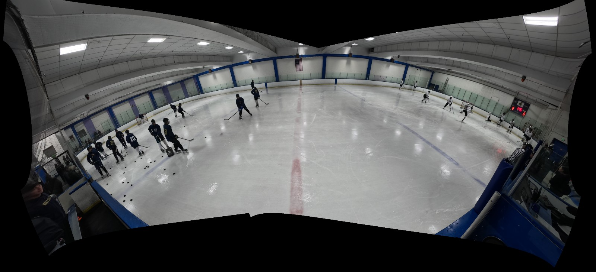
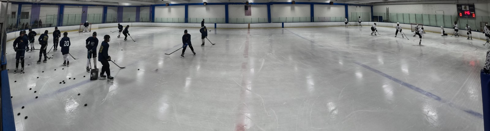

The sabercats preset removes the pronounced arch from the existing panorama by leveling the camera rays before
General Panini projection, then cropping the projected canvas to the rink. It uses the existing calibration and
GPU stitcher. There is no extra per-frame image warp, CPU readback, or intermediate panorama in playback.

Original calibration preview:



The same calibration images with the new view:



The supplied HUDL PNG is a montage of three viewing directions. The supplied video shows changing views with
relatively straight architectural lines, consistent with perspective views extracted from a calibrated panorama.
Those files do not reveal HUDL's proprietary implementation. They also cannot be treated as one pinhole-camera
image with a single global homography. Four rink corners can supply rink-plane orientation and tracking bounds;
moving four pixels in an already curved panorama does not, by itself, straighten all the walls.

HStream was already using General Panini `[100, 0, 0]`. The missing correction was orientation: Hugin's automatic
alignment establishes camera-to-camera registration but does not know the rink's physical level. The previous
`post_stitch_rotate_degrees: -4` only rotates a flat bitmap. It cannot correct the pitch-dependent bow across a
wide projection. Sweeps of camera-space pitch, roll, Panini squeeze and triplane angle showed that a global
`[yaw, pitch, roll] = [0, -35, 3]` correction gave the cleanest continuous rink view here. Triplane introduced
visible changes in slope across the ice; strong squeeze settings increased wall distortion.

The new settings are under `stitching.projection_framing` and take effect with the `nona` backend:

```yaml
projection_framing:
  auto_fov: false
  horizontal_fov: 160
  auto_canvas: true
  auto_crop: false
  rotation_degrees: [0, -35, 3]  # Hugin camera-space yaw, pitch, roll, in degrees
  crop: [0.02, 0.98, 0.54, 1]   # left, right, top, bottom as full-canvas fractions
```

The shared baseline defines `stitching.rink_configs.vallco` with rotation `[0, -35, 0]` and
`stitching.rink_configs.sharks-ice` with `[0, -25, 0]`. Select one in the game-private config:

```yaml
stitching:
  rink_config: vallco  # or sharks-ice
```

This rotates both registered cameras together; their relative alignment remains intact. The selected profile
supplies the rotation when `projection_framing.rotation_degrees` is absent or null. An explicit game value wins,
including `[0, 0, 0]` or a value equal to the venue default. Ordinary config/UI saves preserve that distinction,
so inherited settings follow later profile edits. Runtime workers receive generated snapshots of custom overlay
profiles; the next layered load restores private intent and resolves the current defaults again. With no selected
rink, rotation remains zero for existing games.
These venue angles are starting defaults; mounting position and pitch can vary between recordings.

Crop defaults to `[0, 1, 0, 1]`. Angles must be finite and within ±180 degrees.
Crop fractions must lie in `[0, 1]` and enclose a nonempty rectangle. An explicit crop cannot be combined with
`auto_crop: true`. The existing UI preserves these YAML settings when loading and saving a game; selecting
automatic crop replaces the explicit rectangle. Dedicated rotation/crop UI editors are not provided yet.
Both settings are recorded in map provenance and calibration generation claims, so changes invalidate old maps.

The complete setup-specific preset is [sabercats_preferred_mapping.yaml](../configs/sabercats_preferred_mapping.yaml).
Its camera orientation is measured for this saved rig, not a universal preset for other games or mounts. To replay
the source's saved two-camera control points through native calibration into a **new** review game:

```sh
bazelisk build --config=opt --cpu=k8 //src/libs/stitching:stitching-replay
bazel-bin/src/libs/stitching/stitching-replay \
  "$HOME/Videos/sabercats-16a" \
  "$HOME/Videos/sabercats-16a-preferred" \
  configs/sabercats_preferred_mapping.yaml
```

The destination must not exist. Replay retains the source images and point correspondences, reruns Hugin's
optimizer deterministically, and publishes maps with the normal transaction and validation path. It requires a
matching source-camera FOV and standard HStream `hm_project.pto` point records. Calibrated AKAZE sources are
rejected because their saved points use rectified coordinates that Nona cannot apply to the original images.
The new config references the
original videos by absolute path and discards old panorama-coordinate rink metadata. The source game is preserved.
Open the new game in HStream and select its Stitched preview, or encode the full canvas:

```sh
USE_NEW_NVSTREAMMUX=yes bazel-bin/src/apps/pipeline-app/pipeline-app \
  -g sabercats-16a-preferred -c configs/ds_hockey_app_config.yaml \
  --enable-sources=URI-MULTIPLE --enable-sinks=ENCODE_STITCHED_FILE \
  --options=pipeline.primary-gie.enable=0,pipeline.ds-playtracker.enable=0,pipeline.hmplaycropper.enable=0,pipeline.tracker.enable=0,pipeline.hmaudio.enable=0 \
  -t=10
```

Validation on 2026-09-08:

- Full x86 build: `bazelisk build --config=opt --cpu=k8 //...` passed.
- `game_config_test`, `hugin_project_test`, `configure_stitching_test`, `configurator_persistence_test`, and
  `hstream_ui_test` passed. Coverage includes validation, crop enforcement, view provenance, map invalidation,
  and preservation of the view across UI reload/save.
- Native replay used the original 182 saved correspondences. Output changed from 4183×1914 to 3685×986;
  black pixels fell from 28.34% to 0.002%. The original camera images do not contain enough ceiling in the center
  to reproduce the HUDL montage's exact headroom. Cropping removes that missing coverage rather than filling it.
- GPU archive encoding produced a verified 10.24-second warmup clip at 3686×986 (the encoder pads width to even).
  A later gameplay run starting at 10 minutes was also decoded and visually checked at several timestamps for
  wall shape, player proportions, both goals, and continuity across the stitch. A 20-second H.264 excerpt is saved
  at `~/stitched_video_sabercats_preferred_gameplay.mp4`; the panorama is `~/stitched_video_sabercats_preferred.png`.
- Jetson cross-build of the replay utility and configuration/Hugin tests passed. `game_config_test` ran successfully
  on `stubby`. `hugin_project_test` could not start there because the cross-built binary and a preexisting
  jetson-utils dependency require `GLIBC_2.43`, which the host's libc does not provide. Jetson playback is unverified.

This is a continuous full-rink view. It substantially reduces the original bow, but does not promise perfect
rectilinearity for every line over 160 degrees or reproduce HUDL's moving virtual camera. The complete local
comparison is `~/sabercats_preferred_mapping_comparison.jpg`; projection sweeps and video checks are under
`~/Videos/sabercats-16a/preferred-mapping-review/`.
